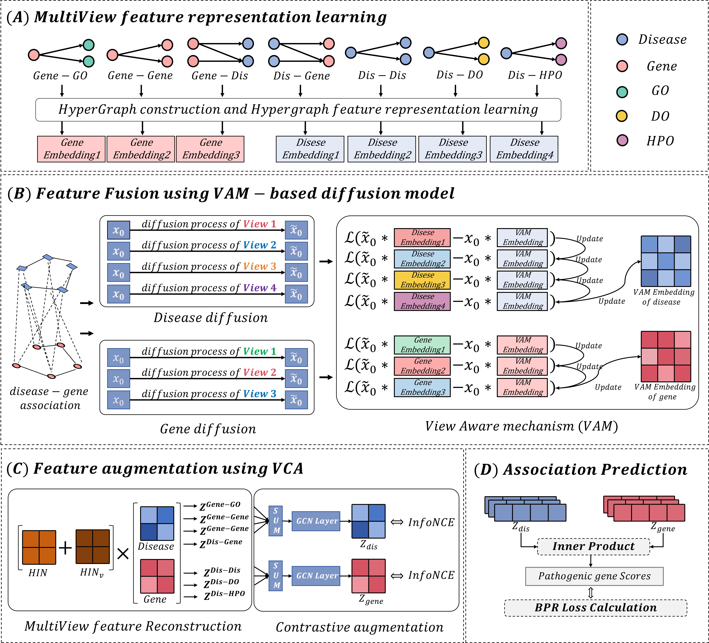
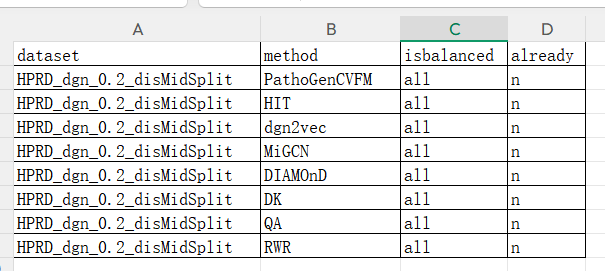
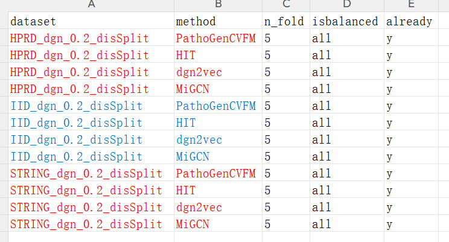

# PathoGenCVFM: Integrating Multi-Source Biological Data via a Cross-View-Aware Feature Fusion Model for Pathogenic Gene Prediction

Integrating multi-source biological data for pathogenic gene prediction is of significance for disease treatment and drug discovery. However, possible noise accumulation and information mismatch in "direct data integration" will directly affect the prediction performance, while most feature fusion-based methods integrate multi-source data just by simple feature fusion like feature concatenation or neural network, which missing the in-depth exploration of potential interaction patterns that different data sources at the level of disease-gene association (DGA). To overcome above limitations, we propose an end-to-end cross-view-aware feature fusion model (PathoGenCVFM) for pathogenic gene prediction from multi-source biological data. In this model, to avoid the possible influence may cause by "direct data integration", multiple independent feature learners are designed for different data source. Meanwhile, a view aware mechanism-based diffusion model (VAM-based DM) is designed to uniformly manage these feature learners and accurately align the deep interaction between every data source. Unlike simply using feature concatenation or neural networks, VAM-based DM can fuse multi-source feature during the restoration of DGA where DGA always serves as the anchor for feature fusion, ensuring the underlying consistency at the level of pathogenic gene prediction. Moreover, a cross-view contrastive augmentation method (VCA) is designed to enhance the fusion features. Finally, the inner product between gene and disease’s fusion features is calculated as the score of pathogenic gene prediction. A series of experiments, including ablation experiments, visualization, case analysis, have demonstrated the effectiveness of PathoGenCVFM.

## I. Framework of PathoGenCVFM

<div style="display: flex; align-items: center;">
    
</div>


## II. Runtime environment
- Python 3.9.12
- gensim 4.4.0
- hypernetx 2.0.0.post1
- matplotlib 3.3.4
- networkx 2.7.1
- numpy 1.26.4
- pandas 1.5.3
- scikit-learn 0.24.1
- torch 2.1.0
- torch-geometric 2.6.1
- gseapy 1.1.10


## III. Executing program
1.Make sure you are in the directory "\~/PathoGenCVFM".\
2.Taking the "test_test_0.2_disMidSplit" dataset as an example, then we will show you the commands for training and testing PathoGenCVFM. You can adjust the required parameters directly.\
3.Due to upload restrictions, we only provided the original predicted results of all methods under balanced conditions in the "\~/Evaluation/Results_method" directory, and the post-evaluation results under balanced and unbalanced conditions in the "\~/Evaluation/Results_statistic" directory.\
4.In "\~/EnrichAnalysis", we have provided the complete original files and results of the enrichment analysis.


### 1.Training and testing PathoGenCVFM
You can train and test PathoGenCVFM using the following command :
```
python Main.py --dataset test --SplitMode disMid --mode train_test --gpu 0 --Exp_name testDemo
```
The params in the above command are explained as follows, please refer to "Params.py" for details :
```
--dataset     The dataset name, which can be set to "test", "iid", or "string".
--SplitMode   The dataset split mode, which can be set to "disMid" or "dis". If set as "dis", there will using the "test_test_0.2_disSplit" dataset.
                     disMid ---> test_test_0.2_disMidSplit， that is, the datasets using disease-based hierarchical division
                     dis    ---> test_test_0.2_disSplit, that is, the datasets using disease-based spectral clustering division
                           
--mode        The mode of the program, which can be set to "train_test", "infer", "finetuning", "casestudy", "foldcv".
                     train_test  --->  Training and testing PathoGenCVFM
                     finetuning  --->  Reading the existing model file and continue training the model
                     infer       --->  Reading the existing feature file and calculate the results for test set
                     casestudy   --->  Reading the existing feature file and Conducting case study for some specific diseases
                     foldcv      --->  Conducting n-fold cross validation (Can only be applied to disease-based spectral clustering division)
                     
--gpu         The GPU id for running program.
--Exp_name    The name of the experiment, which will be used as save path.
```
By using the above commands, you will be able to conduct training and testing on the test_test_0.2_disMidSplit dataset. The related files will be saved at :
```
Prediction Results:  ~/Result/testDemo
Model Files:         ~/Saved_model/testDemo
Feature Files:       ~/Saved_Features/FusionFeats/testDemo
```
For performance evaluation, you can move to Section "IV. Evaluation".


### 2.Finetuning PathoGenCVFM
Make sure you have already trained PathoGenCVFM.\
If yes, there will have some model files in the directory :
```
~/Saved_model/testDemo/DiffusionModel
~/Saved_model/testDemo/HyperGraphLearner
~/Saved_model/testDemo/Multi_ViewDenoise
```
Then you can use the following command to finetune PathoGenCVFM :
```
python Main.py --dataset test --SplitMode disMid --mode finetuning --gpu 0 --Exp_name testDemo
```
Note that the --Exp_name value in the command must be consistent with the path of the model file.
Here, we also provided the features of HPRD_dgn_0.2_disMidSplit. You can verify them using the following commands :
```
python Main.py --dataset hprd --SplitMode disMid --mode finetuning --gpu 0 --Exp_name HPRD_dgn_0.2_disMidSplit
```


### 3.Inference
Make sure you have already trained PathoGenCVFM.\
If yes, there will have some fusion features in the directory :
```
~/Saved_Features/FusionFeats/testDemo
~/Saved_Features/MultiViewFeats/testDemo
```
Then you can use the following command to conduct inference :
```
python Main.py --dataset test --SplitMode disMid --mode infer --Exp_name testDemo
```
Then the prediction results of test_test_0.2_disMidSplit will output in the directory :
```
~/Inference/testDemo
```
Here, we also provided the features of HPRD_dgn_0.2_disMidSplit. You can verify them using the following commands :
```
python Main.py --dataset hprd --SplitMode disMid --mode infer --Exp_name HPRD_dgn_0.2_disMidSplit
```


### 4.Case Study
Make sure you have already trained PathoGenCVFM.\
If yes, there will have some fusion features in the directory :
```
~/Saved_Features/FusionFeats/testDemo
~/Saved_Features/MultiViewFeats/testDemo
```
Then you can use the following command to conduct case study :
```
python Main.py --dataset test --SplitMode disMid --mode casestudy --tgtDis ['C2'] --Exp_name testDemo
```
Then the prediction results of test_test_0.2_disMidSplit will output in the directory :
```
~/CaseStudy/testDemo
```
Here, we also provided the features of HPRD_dgn_0.2_disMidSplit. You can verify them using the following commands :
```
python Main.py --dataset hprd --SplitMode disMid --mode casestudy --tgtDis ['C0002395'] --Exp_name HPRD_dgn_0.2_disMidSplit
```

### 4.n-Fold Cross Validation
The n-Fold Cross-validation will be conducted on test_test_0.2_disSplit instead of test_test_0.2_disMidSplit.\
Here, we present a 5-fold cross-validation on test_test_0.2_disSplit dataset :
```
python Main.py --dataset test --SplitMode dis --mode foldcv --n_fold 5 --gpu 0 --Exp_name testDemo_CV
```
By executing the above commands, the program will automatically divide the dataset into 5 clusters using spectral clustering and save them in the following paths :
```
~/Datasets/test_test_0.2_disSplit_Fold_1
~/Datasets/test_test_0.2_disSplit_Fold_2
.......
~/Datasets/test_test_0.2_disSplit_Fold_5
```
Then the program will automatically read these datasets and conduct training and testing. The results will saved at :
```
~/Result/test_test_0.2_disSplit_Fold_1_testDemo_CV
~/Result/test_test_0.2_disSplit_Fold_2_testDemo_CV
.......
~/Result/test_test_0.2_disSplit_Fold_5_testDemo_CV
```

### 4.1 Inference and CaseStudy of n-Fold Cross Validation
```
python Main.py --dataset test --SplitMode dis --mode infer --exe_fold 1 --gpu 0 --Exp_name testDemo_CV
python Main.py --dataset test --SplitMode dis --mode infer --exe_fold 2 --gpu 0 --Exp_name testDemo_CV
python Main.py --dataset test --SplitMode dis --mode infer --exe_fold 3 --gpu 0 --Exp_name testDemo_CV
python Main.py --dataset test --SplitMode dis --mode infer --exe_fold 4 --gpu 0 --Exp_name testDemo_CV
python Main.py --dataset test --SplitMode dis --mode infer --exe_fold 5 --gpu 0 --Exp_name testDemo_CV

python Main.py --dataset test --SplitMode dis --mode casestudy --exe_fold 1 --gpu 0 --tgtDis ['C1'] --Exp_name testDemo_CV
python Main.py --dataset test --SplitMode dis --mode casestudy --exe_fold 2 --gpu 0 --tgtDis ['C6'] --Exp_name testDemo_CV
python Main.py --dataset test --SplitMode dis --mode casestudy --exe_fold 3 --gpu 0 --tgtDis ['C3'] --Exp_name testDemo_CV
python Main.py --dataset test --SplitMode dis --mode casestudy --exe_fold 4 --gpu 0 --tgtDis ['C4'] --Exp_name testDemo_CV
python Main.py --dataset test --SplitMode dis --mode casestudy --exe_fold 5 --gpu 0 --tgtDis ['C5'] --Exp_name testDemo_CV
```
By executing the above commands, the program will automatically conducting inference/casestudy and save them in the following paths :
```
~/Inference/testDemo_CV
~/CaseStudy/testDemo_CV
```

### 4.2 finetuning of n-Fold Cross Validation
```
python Main.py --dataset test --SplitMode dis --exe_fold 1  --mode finetuning --gpu 0 --Exp_name testDemo_CV
python Main.py --dataset test --SplitMode dis --exe_fold 2  --mode finetuning --gpu 0 --Exp_name testDemo_CV
python Main.py --dataset test --SplitMode dis --exe_fold 3  --mode finetuning --gpu 0 --Exp_name testDemo_CV
python Main.py --dataset test --SplitMode dis --exe_fold 4  --mode finetuning --gpu 0 --Exp_name testDemo_CV
python Main.py --dataset test --SplitMode dis --exe_fold 5  --mode finetuning --gpu 0 --Exp_name testDemo_CV
```
By executing the above commands, the program will automatically conducting finetuning.


## IV. Evaluation
### 1.Evaluation of single method
To evaluate the model performance, you should move the result file from "\~/Result/testDemo" to "\~/Evaluation/Results_method/PathoGenCVFM".\
Then you should set configurations in the following file:
```
~/Evaluation/config_Topk.xlsx
```
The demo of these two files are as follows, you can adjust the parameters according to your needs.

<div style="display: flex; align-items: center;">
    
</div>

The params in above file are explained as follows :
```
--dataset      The dataset name
--method       The method name
--isbalanced   There are three values: "balance", "unbalance", "all". 
                      "balance" means only evaluating the balanced test set,
                      "unbalance" means only evaluating the imbalanced test set, 
                      "all" means evaluating both balanced and imbalanced test sets.
--already     There are two values: "y", "n".
                      "y" indicates that it is excluded from the evaluation process.
                      "n" indicates that using it for evaluation.
```
Then, method's evaluation results can be obtained by executing the following command:
```
python Evaluation/1.Result_Cal_TopK.py
```
By executing above command, the results will be saved in the following path:
```
~/Evaluation/Results_statistic
```

### 2.Performance comparison among different methods
Make sure you have already run "python Evaluation/1.Result_Cal_TopK.py" for all methods\
If a performance comparison is required, it can be achieved through the following command:
```
python Evaluation/2.Statistic_Result.py
```
Make sure the configiration has been set in the following file:
```
~/Evaluation/config_statistic.xlsx
```
By executing above command, the results will be saved in the following path:
```
~/Evaluation/Summarize
```

### 3.n-Fold CV performance comparison among different methods
If a performance comparison is required, then you should set configurations in the following file:
```
~/Evaluation/config_statistic_FoldCV.xlsx
```

<div style="display: flex; align-items: center;">
    
</div>

Then it can be achieved through the following command:
```
python Evaluation/3.Statistic_FoldCVResult.py
```
By executing above command, the results will be saved in the following path:
```
~/Evaluation/Summarize
```


## V. GO Enrichment analysis and KEGG Enrichment analysis
Make sure you have already conducted CaseStudy by the following command:
```
python Main.py --dataset hprd --SplitMode disMid --mode casestudy --tgtDis ['C0002395'] --Exp_name HPRD_dgn_0.2_disMidSplit
```
Then you should copy "HPRD_dgn_0.2_disMidSplit" from "\~/Datasets" to "\~/EnrichAnalysis/Datasets".\
Final, copy "HPRD_dgn_0.2_disMidSplit" from "\~/CaseStudy" to "\~/EnrichAnalysis/PredAssociations", and rename them as "HPRD_dgn_0.2_disMidSplit_PathoGenCVFM".\

All the documents have been prepared for you. You can view them in the corresponding folder.
Then you can conduct GO Enrichment analysis and KEGG Enrichment analysis by executing the following command:
```
python EnrichAnalysis/1.Get_PredList_from_QuestDis.py
```
By executing above command, the TopK genes will be saved in the following path:
```
~/EnrichAnalysis/QuestDisResults
```
Final, you can conduct GO Enrichment analysis and KEGG Enrichment analysis by executing the following command:
```
python EnrichAnalysis/2.MyGseapy.py
```
By executing above command, the results of enrichment analysis will be saved in the following path:
```
~/EnrichAnalysis/Output
```

